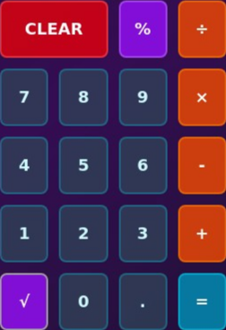

# 🚀 Calculadora Futurista

Una calculadora con diseño innovador y efectos visuales futuristas, construida con React y Tailwind CSS.



## ✨ Características

- 🎨 **Diseño Futurista**: Efectos de brillo, partículas flotantes y animaciones suaves
- 🔢 **Funcionalidad Completa**: Operaciones básicas, raíz cuadrada y porcentaje
- 📱 **Responsive**: Optimizada para desktop, tablet y móvil
- 📊 **Historial**: Panel que muestra las últimas operaciones realizadas
- ⚡ **Efectos Interactivos**: Hover, escalado y ondas al hacer clic

## 🛠️ Tecnologías Utilizadas

- **React 18** - Framework de JavaScript
- **Tailwind CSS** - Framework de CSS utilitario
- **Vite** - Bundler y servidor de desarrollo
- **shadcn/ui** - Componentes de interfaz de usuario

## 🚀 Instalación y Uso

### Prerrequisitos
- Node.js (versión 18 o superior)
- npm o pnpm

### Instalación
```bash
# Clonar el repositorio
git clone https://github.com/tu-usuario/calculadora-futurista.git

# Navegar al directorio
cd calculadora-futurista

# Instalar dependencias
npm install
# o
pnpm install
```

### Desarrollo
```bash
# Iniciar servidor de desarrollo
npm run dev
# o
pnpm dev

# La aplicación estará disponible en http://localhost:5173
```

### Construcción para Producción
```bash
# Construir para producción
npm run build
# o
pnpm build

# Previsualizar la construcción
npm run preview
# o
pnpm preview
```

## 🎨 Características del Diseño

### Efectos Visuales
- **Fondo Degradado**: Gradiente espacial azul-púrpura
- **Bordes Luminosos**: Animaciones de pulso con luz cyan
- **Efecto de Escaneo**: Línea de luz que se desplaza en la pantalla
- **Partículas Flotantes**: Puntos de luz en movimiento continuo
- **Ondas de Clic**: Efectos radiales al presionar botones

### Paleta de Colores
- **Primario**: Cyan (#00f5ff)
- **Secundario**: Púrpura (#8b5cf6)
- **Acento**: Naranja (#f97316)
- **Fondo**: Degradado de grises oscuros

## 📱 Funcionalidades

- ➕ Suma
- ➖ Resta
- ✖️ Multiplicación
- ➗ División
- √ Raíz cuadrada
- % Porcentaje
- 🗂️ Historial de operaciones
- 🧹 Función Clear

## 🌐 Demo en Vivo

[Ver Demo](https://tu-usuario.github.io/calculadora-futurista)

## 📄 Licencia

Este proyecto está bajo la Licencia MIT. Ver el archivo [LICENSE](LICENSE) para más detalles.

## 🤝 Contribuciones

Las contribuciones son bienvenidas. Por favor:

1. Fork el proyecto
2. Crea una rama para tu feature (`git checkout -b feature/AmazingFeature`)
3. Commit tus cambios (`git commit -m 'Add some AmazingFeature'`)
4. Push a la rama (`git push origin feature/AmazingFeature`)
5. Abre un Pull Request

## 👨‍💻 Autor

Creado con ❤️ por [Tu Nombre]

## 🙏 Agradecimientos

- Inspirado en diseños de interfaces futuristas
- Construido con tecnologías modernas de desarrollo web
- Efectos visuales inspirados en la estética cyberpunk

